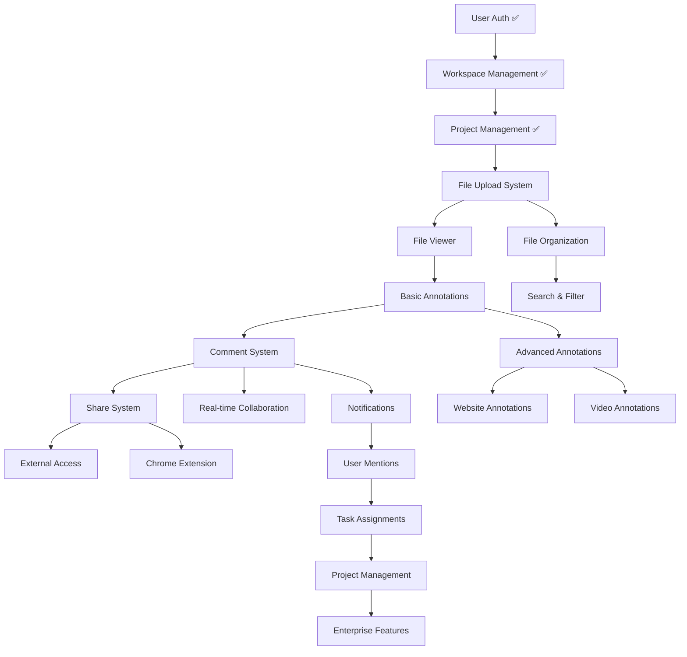

# Feature Dependency Matrix & Technical Specifications

## Dependency Graph Overview



## Critical Path Analysis

### Tier 1: Foundation (Must Complete First)
**Status: ✅ COMPLETE**
- User Authentication (Clerk)
- Workspace Management
- Project Management
- Database Schema

### Tier 2: Core Content System (Weeks 1-4)
**Dependencies:** Tier 1 ✅
**Critical Path:** File Upload → File Viewer → Annotations → Comments

1. **File Upload System** (Week 1)
   - **Blocks:** All other features
   - **Risk Level:** HIGH
   - **Dependencies:** Supabase storage configuration

2. **File Viewer** (Week 2)
   - **Blocks:** Annotation system
   - **Risk Level:** HIGH
   - **Dependencies:** File upload ✅

3. **Basic Annotation System** (Week 3)
   - **Blocks:** All collaboration features
   - **Risk Level:** CRITICAL
   - **Dependencies:** File viewer ✅

4. **Comment System** (Week 4)
   - **Blocks:** Real-time features, sharing
   - **Risk Level:** HIGH
   - **Dependencies:** Annotations ✅

### Tier 3: Collaboration Layer (Weeks 5-8)
**Dependencies:** Tier 2 ✅
**Parallel Development Possible**

- **Share System** (Week 5) - Independent
- **Real-time Collaboration** (Week 6) - Depends on Comments
- **Notifications** (Week 7) - Depends on Comments
- **Advanced Annotations** (Week 8) - Depends on Basic Annotations

### Tier 4: Organization & Workflow (Weeks 9-12)
**Dependencies:** Tier 3 ✅
**Highly Parallel Development**

- **File Organization** (Week 9) - Depends on File System
- **Search & Filter** (Week 10) - Depends on Organization
- **User Mentions** (Week 11) - Depends on Notifications
- **Project Management** (Week 12) - Depends on Assignments

### Tier 5: Advanced Features (Weeks 13-16)
**Dependencies:** Tier 4 ✅
**Independent Development Possible**

- **Website Annotations** (Week 13) - Depends on Advanced Annotations
- **Video Annotations** (Week 14) - Depends on Advanced Annotations
- **Chrome Extension** (Week 15) - Depends on Website Annotations + Share
- **Enterprise Features** (Week 16) - Depends on Complete System

---

## Technical Specifications by Feature

### 1. File Upload System (Week 1)

#### Technical Requirements
```typescript
interface FileUploadConfig {
  maxFileSize: 500 * 1024 * 1024 // 500MB
  allowedTypes: ['image/*', 'application/pdf', 'video/*', 'text/html']
  chunkSize: 1024 * 1024 // 1MB chunks for large files
  concurrentUploads: 3
}
```

#### Dependencies
- **Supabase Storage:** Bucket configuration with RLS policies
- **React Dropzone:** File selection and drag-drop
- **File Processing:** Image thumbnails, PDF preview, video metadata

#### API Endpoints
```typescript
POST /api/files/upload-url     // Generate signed upload URL
POST /api/files/complete       // Complete upload and save metadata
GET  /api/files/:id           // Retrieve file data
DELETE /api/files/:id         // Delete file
```

#### Database Impact
- Uses existing `File` model
- Requires `FileStatus` enum for upload tracking
- Metadata field stores file-specific data

---

### 2. File Viewer (Week 2)

#### Technical Requirements
```typescript
interface ViewerCapabilities {
  imageFormats: ['jpg', 'png', 'gif', 'webp', 'svg']
  pdfSupport: 'pdf.js' // Mozilla PDF.js integration
  videoFormats: ['mp4', 'webm', 'ogg']
  maxZoom: 500 // 500% zoom level
  panSupport: boolean
}
```

#### Dependencies
- **PDF.js:** PDF rendering and text extraction
- **Video.js:** Video player with custom controls
- **Canvas API:** Image manipulation and zoom
- **File Upload System:** ✅ Required

#### Components Architecture
```typescript
<FileViewer>
  <ImageViewer />     // Images with zoom/pan
  <PDFViewer />       // PDF.js integration
  <VideoViewer />     // Video.js player
  <WebsiteViewer />   // Iframe/snapshot viewer
</FileViewer>
```

---

### 3. Basic Annotation System (Week 3)

#### Technical Requirements
```typescript
interface AnnotationSystem {
  tools: ['pin', 'box', 'highlight', 'timestamp']
  coordinateSystem: 'normalized' // 0-1 coordinates
  precision: number // Pixel precision
  realTimeSync: boolean
}
```

#### Dependencies
- **File Viewer:** ✅ Required for coordinate mapping
- **Canvas Overlay:** For annotation rendering
- **Mouse/Touch Events:** Cross-device interaction
- **Database Schema:** Uses `Annotation` model with `target` field

#### Coordinate System
```typescript
interface NormalizedCoordinates {
  x: number // 0-1 relative to content width
  y: number // 0-1 relative to content height
  width?: number // For box annotations
  height?: number // For box annotations
}
```

---

### 4. Comment System (Week 4)

#### Technical Requirements
```typescript
interface CommentSystem {
  threading: boolean // Nested replies
  statusTracking: ['OPEN', 'IN_PROGRESS', 'RESOLVED']
  realTimeUpdates: boolean
  mentionSupport: boolean // @username
}
```

#### Dependencies
- **Annotation System:** ✅ Required for comment linking
- **Rich Text Editor:** For formatted comments
- **Notification System:** For comment alerts
- **Database Schema:** Uses `Comment` model with threading

#### Comment Threading
```typescript
interface CommentThread {
  rootComment: Comment
  replies: Comment[]
  depth: number // Max 3 levels deep
  status: CommentStatus
}
```

---

### 5. Share System (Week 5)

#### Technical Requirements
```typescript
interface ShareSystem {
  tokenGeneration: 'uuid' // Cryptographically secure
  permissionLevels: ['VIEW_ONLY', 'COMMENT', 'ANNOTATE']
  expirySupport: boolean
  passwordProtection: boolean
  viewTracking: boolean
}
```

#### Dependencies
- **Comment System:** ✅ Required for permission validation
- **JWT Tokens:** For secure access without login
- **Database Schema:** Uses `ShareableLink` model

#### Security Considerations
```typescript
interface ShareSecurity {
  tokenExpiry: number // Default 30 days
  viewLimit: number // Optional view count limit
  ipRestriction: string[] // Optional IP whitelist
  passwordHash: string // bcrypt hashed passwords
}
```

---

### 6. Real-time Collaboration (Week 6)

#### Technical Requirements
```typescript
interface RealtimeSystem {
  transport: 'websocket' // Supabase Realtime
  channels: ['project:id', 'file:id']
  eventTypes: ['annotation.created', 'comment.added', 'user.joined']
  presenceTracking: boolean
}
```

#### Dependencies
- **Comment System:** ✅ Required for real-time comments
- **Supabase Realtime:** WebSocket infrastructure
- **Presence System:** User activity tracking

#### Event Architecture
```typescript
interface RealtimeEvent {
  type: string
  payload: any
  userId: string
  timestamp: number
  channel: string
}
```

---

### 7. Notification System (Week 7)

#### Technical Requirements
```typescript
interface NotificationSystem {
  deliveryMethods: ['in-app', 'email', 'webhook']
  eventTypes: NotificationType[]
  batchingSupport: boolean
  unsubscribeOptions: boolean
}
```

#### Dependencies
- **Comment System:** ✅ Required for comment notifications
- **Email Service:** SendGrid/Resend integration
- **Database Schema:** Uses `Notification` model

#### Notification Types
```typescript
enum NotificationType {
  COMMENT_ADDED = 'comment.added',
  COMMENT_REPLY = 'comment.reply',
  COMMENT_MENTION = 'comment.mention',
  COMMENT_RESOLVED = 'comment.resolved',
  ANNOTATION_ADDED = 'annotation.added',
  PROJECT_SHARED = 'project.shared',
  FILE_UPLOADED = 'file.uploaded',
  WORKSPACE_INVITE = 'workspace.invite'
}
```

---

### 8. Advanced Annotations (Week 8)

#### Technical Requirements
```typescript
interface AdvancedAnnotations {
  webTargeting: 'css-selectors' // W3C-style targeting
  textAnchoring: 'quote-based' // Text selection anchoring
  fallbackStrategies: ['xpath', 'position', 'attributes']
  versioningSupport: boolean
}
```

#### Dependencies
- **Basic Annotations:** ✅ Required foundation
- **Text Selection API:** For text highlighting
- **DOM Traversal:** For element targeting

#### Web Annotation Targeting
```typescript
interface WebTarget {
  selector: {
    type: 'CssSelector' | 'XPathSelector' | 'TextQuoteSelector'
    value: string
    refinedBy?: WebTarget
  }
  source: string // URL or document identifier
}
```

---

## Risk Assessment & Mitigation

### High-Risk Dependencies

#### 1. File Upload System (Week 1)
**Risk:** Complex file handling, large file support
**Mitigation:** 
- Implement chunked uploads
- Add comprehensive error handling
- Test with various file types and sizes

#### 2. Real-time Collaboration (Week 6)
**Risk:** WebSocket connection management, conflict resolution
**Mitigation:**
- Implement connection retry logic
- Add offline support with sync
- Use operational transformation for conflicts

#### 3. Website Annotation (Week 13)
**Risk:** Cross-origin restrictions, dynamic content
**Mitigation:**
- Use server-side snapshots
- Implement stable element identification
- Add fallback positioning strategies

### Performance Considerations

#### File Processing
- **Image Optimization:** Generate multiple sizes, WebP format
- **PDF Rendering:** Lazy load pages, cache rendered content
- **Video Processing:** Generate thumbnails, support streaming

#### Database Optimization
- **Indexing:** Add indexes for frequently queried fields
- **Query Optimization:** Use proper joins and aggregations
- **Caching:** Implement Redis for frequently accessed data

#### Frontend Performance
- **Code Splitting:** Load components on demand
- **Virtual Scrolling:** Handle large lists efficiently
- **Image Lazy Loading:** Load images as needed

---

## Testing Strategy

### Unit Testing (Each Sprint)
- **Component Testing:** React Testing Library
- **API Testing:** Jest + Supertest
- **Database Testing:** Prisma test database
- **Utility Testing:** Pure function testing

### Integration Testing (End of Each Phase)
- **API Integration:** Full request/response testing
- **Database Integration:** Schema and migration testing
- **Third-party Integration:** Mock external services

### End-to-End Testing (Major Releases)
- **User Workflows:** Playwright automation
- **Cross-browser Testing:** BrowserStack integration
- **Performance Testing:** Lighthouse CI
- **Accessibility Testing:** axe-core integration

### Load Testing (Before Production)
- **File Upload Testing:** Large file handling
- **Concurrent User Testing:** Real-time collaboration limits
- **Database Performance:** Query optimization validation

---

This dependency matrix ensures that development proceeds in the correct order, minimizing blockers and maximizing parallel development opportunities. Each feature builds upon solid foundations while maintaining the flexibility to adapt to changing requirements.
